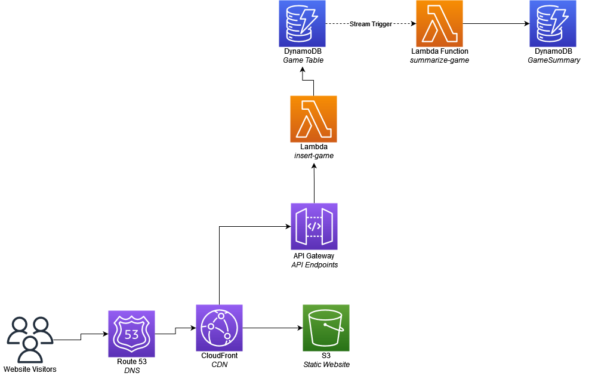

# VolleyBill

A set of serverless apps to manage scores and payments for pickup volleyball leagues.

The goal was to build a dynamic, secure application as cheaply as possible on AWS.

## Architecture



## Setup
### Building infrastructure
1. Modify any configuration variable values in `terraform/backend.conf` and `terraform/terraform.tfvars`.
2. Manually create an s3 bucket for your terraform state (name it the same as in your `terraform/backend.conf` file).
3. `cd` into the `terraform` directory and run `terraform init -backend-config=backend.conf`.
4. Manually import your terraform state bucket with `terraform import aws_s3_bucket.terraform_state volleybill.com-state`.
5. Run `terraform plan`, and then if everything looks good, `terraform apply`.
6. Rinse and repeat step 5 anytime you make changes to the infrastructure.


## TODO:
 - Add project tag to all resources:
   ```
   tags = {
    project = "${var.domain}"
   }
   ```